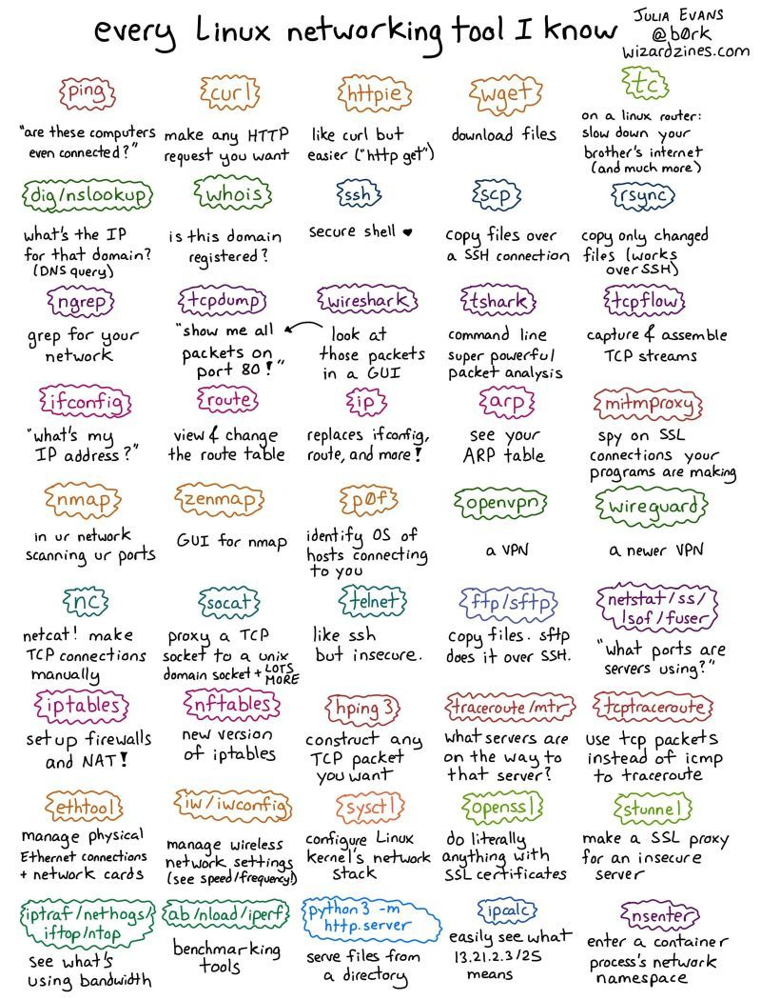

# blog

# Tools
https://explaineverything.com/

# Github Markdown cheatsheet
https://docs.github.com/en/get-started/writing-on-github

https://github.com/adam-p/markdown-here/wiki/Markdown-Cheatsheet

# SQL
Querying:
1. Subquery
2. Common Table Expression
3. View

# Numpy
'Numpy' is the short form for 'numeric python'.

Operations:

#SAPLEMM
1. *S*quare root
2. *A*bsolute
3. *P*ower
4. *L*ogarithm
5. *E*xponential
6. *M*inimum
7. *M*aximum


# inner 
import numpy as np

1-D array example:

A = np.array([[1,2,3],[4,5,6]])

B = np.array([[2,2,2],[2,2,2]])

C = np.inner(A, B)

print(C)


A:
[[1 2 3]
 [4 5 6]]


B:
[[2 2 2]
 [2 2 2]]


C:
[[12 12]
 [30 30]]


Reference:  https://numpy.org/doc/stable/reference/generated/numpy.inner.html


# Pandas
'Pandas' is the short form for 'Panel data'.


Common Table Expressions (CTE)

Perhaps its more meaningful to think of a CTE as a substitute for a view used for a single query. But doesn't require the overhead, metadata, or persistence of a formal view. Very useful when you need to:

Create a recursive query.
Use the CTE's resultset more than once in your query.
Promote clarity in your query by reducing large chunks of identical subqueries.
Enable grouping by a column derived in the CTE's resultset.

Reeference:  https://stackoverflow.com/questions/4740748/when-to-use-common-table-expression-cte


# Set vs JOIN

| SET | JOIN
| --- | ---
| Vertical stacking | Horizontal stacking 
| The number of columns and datatypes must match.  The number of rows can differ. | The number of columns and datatypes may mismatch. 


# Matrix operations
| Matrix operation | Output
| --- | ---
| Dot product | Scalar 
| Cross product | Vector 


# Cross product

```
import numpy as np


def cross_product(a, b):
    i_component = a[1] * b[2] - a[2] * b[1]
    j_component = a[2] * b[0] - a[0] * b[2]
    k_component = a[0] * b[1] - a[1] * b[0]
    return [i_component, j_component, k_component]


def numpy_cross_product(a, b):
    return np.cross(a, b)


if __name__ == "__main__":
    a = [1, 2, 3]
    print(" a: ", a)

    b = [4, 5, 6]
    print(" b: ", b)

    cross_product = cross_product(a, b)
    print("\n cross_product: ", cross_product)

    cross_product_using_numpy = numpy_cross_product(a, b)
    print(" cross_product_using_numpy: ", cross_product_using_numpy)
```

## Output

```
a:  [1, 2, 3]
b:  [4, 5, 6]

cross_product:  [-3, 6, -3]
cross_product_using_numpy:  [-3  6 -3]
```

# Hadamard product

https://en.wikipedia.org/wiki/Hadamard_matrix

https://stackoverflow.com/questions/30437418/how-can-i-find-out-if-a-b-is-a-hadamard-or-dot-product-in-numpy


# Database benchmarking

The TPC is a non-profit corporation focused on developing data-centric benchmark standards and disseminating objective, verifiable data to the industry.

https://tpc.org/

The database performance is directly related to I/O.


# Database stored procedures vs functions

| Stored procedures | Functions
| --- | ---
| perform actions | return a value 
| may or may not return values | can be used in SQL queries 


# Database optimizers

Up until the 4th normalized form, the optimizers can be impactful.  Beyond 4th normal form, the optimizers would be challenged.  For practical purposes, designing up until 3rd or 4th normal form and Boyce-Codd normalization would suffice.

# Vector databases
The following are some of the leading Vector databases:

1. [Pinecone](https://www.pinecone.io/ "Pinecone's Homepage")
2. [Milvus](https://milvus.io/ "Milvus's Homepage")
3. [Weaviate](https://weaviate.io/ "Weaviate's Homepage")

Qdrant (https://qdrant.tech/) is a vector database implemented using Rust.

# Wolfram Computational Intelligence
https://www.wolframalpha.com/

Compute answers using Wolfram's breakthrough technology & knowledgebase, relied on by millions of students & professionals.

# Calculus formulae
https://byjus.com/calculus-formulas/

https://sac.edu/AcademicProgs/ScienceMathHealth/MathCenter/Documents/calculus%20cheat%20sheet.pdf


# Types of Gradient descent learning algorithms
1. Batch gradient descent
2. Stochastic gradient descent
3. Mini-batch gradient descent

# Mathematics
https://math.stackexchange.com/

# D-Tale
https://github.com/man-group/dtale

# Realtime Streaming analytics
https://github.com/madderle/Capstone-Realtime-Streaming-Analytics

# Best 16 Vector Databases for 2024
https://lakefs.io/blog/12-vector-databases-2023/

# Animated Math
https://www.youtube.com/c/3blue1brown

https://www.3blue1brown.com/topics/linear-algebra

# Linear Algebra
Multiplication can be only between matrices or between a matrix and a vector.  It can not be between vectors.

Dot product of vectors tells how similar in direction the two vectors are.

a.b = |a||b|cos(o)

| Dot product | Cross product
| --- | ---
| Returns a scalar | Returns a vector
| Inner product | Outer product 


Linear Independence = Matrix rank

Matrix multiplication is nothing but a bunch of Inner (or Dot) products of all rows of matrix A with all columns of matrix B.

Conceptually, 'matrix multiplication' is a 'linear transformation of spaces'.

Shear mapping = if we shift vertically

Application of 'determinant' of Matrix:  Determinant tells whether the matrix can be inverted or not.

Determinant tells the change of areas when a region in one space is transformed to another region in a different space.

Application of determinant:  If determinant of a matrix is 0, then there is no inverse of that matrix.  So we are compressing the dimension which helps in dimensionality reduction.  So, looking for determinant = 0 for highly correlated features can help reduce that feature / dimension.

Symmetric matrix: A = Transpose of A

If A is an orthogonal matrix or orthonormal matrix, then (A) into (Transpose of A) = I.


Principle Component Analysis (PCA) is nothing but Identity decomposition.  
1. PCA is meant for dimension reduction.
2. PCA is not meant for Feature selection.

Note:  If you are going to go the PCA route, then you dont have to do Feature selection.  For example, if you are using Linear regression, then you typically dont do PCA.

Eigen decomposition of vectors:
Eigen values and Eigen vectors exist in 'complex' space.  It exists only sometimes 'real' space.

Eigen vector and Eigen values:  If the value and direction are unaffected, then they are independent (from a transformation perspective).

Determinant of a matrix = product of its eigen values

Covariance matrices are symmetric.

Median is insensitive to outliers.

https://numpy.org/doc/stable/reference/routines.linalg.html

https://en.wikipedia.org/wiki/Homoscedasticity_and_heteroscedasticity

R^2 is the Explained part of the error.  So, a high value of R^2 is recommended.

Moore-Penrose pseudo inverse:
https://en.wikipedia.org/wiki/Moore%E2%80%93Penrose_inverse

Determinant is not the same as dot product.
The determinant of a matrix A is equal to the determinant of its transpose.

A non-singular matrix means, it has a determinant which is not zero.

Not all matrices have an inverse.

Determinant value is the Volume.

Determinant of singular matrices = 0

Eigen vectors and Inverse matrices do not exist for all matrices.

Coefficient of determination = R-squared

OLS (Ordinary Least square) can be achieved by a variety of ways like Gradient Descent, PCA, etc.

PCA can not perform scaling and normalization.

Matrix inversion method is more prone to numerical instability  than the Gradient Descent method.

The linalg.sklearn internally uses OLS
https://scikit-learn.org/stable/modules/generated/sklearn.linear_model.LinearRegression.html


In "overfitting", the line will go through "data points" and "noise or error points".  This is called "overfitting" because no room for "error" to participate in the equation.


| Eigen value decomposition | Singular value decomposition
| --- | ---
| Uses Eigen vector and Eigen values | Uses Singular vector and Singular values


The following are the methods to check if the independent variables in a linear regression model are linearly independent:
1. Correlation matrix
2. Scatter plot matrix
3. Variance inflation factor


# Notes
Submatrix = co-factor

# Probability

Benford's law:
https://en.wikipedia.org/wiki/Benford%27s_law

Pareto principle:
https://en.wikipedia.org/wiki/Pareto_principle
https://blog.hubspot.com/marketing/pareto-principle

Set = well defined collection of objects
Fruits = { Apple, Pear, Mango }

Statistics:  science of perception where to try to understand the world
Mathmatics: a way to understand all universes
Physics:  trying to understand our reality

Newton's law:
F = G M m / (r ^ 2)

Axiom:  self evident true statement

Binomial coefficient = Combination

*Law of Large Numbers:*
https://en.wikipedia.org/wiki/Law_of_large_numbers

*Central limit theorem:*
https://en.wikipedia.org/wiki/Central_limit_theorem

*Negative Binomial distribution:*
https://en.wikipedia.org/wiki/Negative_binomial_distribution

*Bayes theorem:*
https://www.freecodecamp.org/news/bayes-rule-explained/

"expected" is an integral of "likely".
"density" is an integral of "mass".

Functions:
1.  Cumulative Distribution Function (CDF):  https://en.wikipedia.org/wiki/Cumulative_distribution_function
2.  Probability Mass Function (PMF):  https://en.wikipedia.org/wiki/Probability_mass_function
3.  Probability Density Function (PDF):  https://en.wikipedia.org/wiki/Probability_density_function


Bernoulli distribution:
https://en.wikipedia.org/wiki/Bernoulli_distribution

The probability distribution of coin tosses can be explained by Bernoulli distribution.


CDF is an integral of PMF.

CDF applies to both discrete and continuous, but PDF applies to only continuous variables.

Binomial distribution is a _collection_ of _independent_ Bernoulli trials.


https://learningeconometrics.blogspot.com/2016/09/four-moments-of-distribution-mean.html

| Movement | Concept
| --- | ---
| First movement | Mean
| Second movement | Variance
| Third movement | Skew
| Fourth movement | Kurtosis


Normal distribution = Gaussian distribution

Outliers are 3-Sigma events.


The famous case where the 3-Sigma events are very rare is the LTCM collapse in the 1990s:
https://en.wikipedia.org/wiki/Long-Term_Capital_Management


The most important property of *Expectation* is *linearity*.

Standard Normal Distribution table:
https://www.math.arizona.edu/~rsims/ma464/standardnormaltable.pdf


# "Pattern recognition and Machine Learning”, by Christopher Bishop

https://www.amazon.com/Pattern-Recognition-Learning-Information-Statistics/dp/0387310738/ref=asc_df_0387310738/?tag=hyprod-20&linkCode=df0&hvadid=312125971120&hvpos=&hvnetw=g&hvrand=6330914398694388717&hvpone=&hvptwo=&hvqmt=&hvdev=c&hvdvcmdl=&hvlocint=&hvlocphy=9032030&hvtargid=pla-523035035000&psc=1&mcid=82bf1d9d2860386b80decce93dc3f017&tag=&ref=&adgrpid=61316180839&hvpone=&hvptwo=&hvadid=312125971120&hvpos=&hvnetw=g&hvrand=6330914398694388717&hvqmt=&hvdev=c&hvdvcmdl=&hvlocint=&hvlocphy=9032030&hvtargid=pla-523035035000&gclid=CjwKCAjw_e2wBhAEEiwAyFFFo7ByO_gxYTVRuhOp1XcSMw4y5uIGG57YBjvplvFRu26HFB27Xf3V5BoCWM4QAvD_BwE

# LightGBM (Light Gradient Boosting Machine)
https://www.geeksforgeeks.org/lightgbm-light-gradient-boosting-machine/

# Black Monday 1987
https://en.wikipedia.org/wiki/Black_Monday_(1987)

# Beta distribution
https://en.wikipedia.org/wiki/Beta_distribution

# Conjugate prior
https://en.wikipedia.org/wiki/Conjugate_prior

# t-distribution
https://en.wikipedia.org/wiki/Student%27s_t-distribution

The t-distribution becomes normal distribution as the sample size increases.  When the sample size increases, the degrees of freedom increases as well.

# Memoryless property
https://www.statisticshowto.com/memoryless-property/

# Monte Carlo method
https://en.wikipedia.org/wiki/Monte_Carlo_method

# Frequentist statistics
https://reflectivedata.com/dictionary/frequentist-statistics/

# Git markdown for calculus formulae and greek letters

$\sqrt{3x + 1} + (1+x)^2$

```
&psi; | &#968; | Greek small letter psi | w |
&omega; | &#969; | Greek small letter omega | w |
```

# Posterior, Likelihood and Prior
Posterior is proportional to the product of likelihood and prior.

# Other conjugate prior examples

| Name | Description
| --- | ---
| Beta-Bernoulli | Here Beta is conjugate and Bernoulli is likelihood
| Gamma-Poisson | Here Gamma is conjugate and Bernoulli is likelihood
| Dirichlet-Multinomial | Here Dirichlet is conjugate and Multinomial is likelihood

# Prior, Posterior
| Name | Description
| --- | ---
| Prior | Hypothesis or belief, before any data has been incorporated
| Posterior | The understanding of the distribution of the data, after incorporating data

# COVID-19 data
https://github.com/owid/covid-19-data/tree/master/public/data

# t-distribution
When the sample size is 30 or less, then t-distribution is typically the choice.

https://www.tdistributiontable.com/

Beta distribution is a the conjugate prior for Binomial likelihood.

# Cumulative distribution function
https://en.wikipedia.org/wiki/Cumulative_distribution_function

# Statistics

| Name | Description
| --- | ---
| Probability | Deal with uncertainty
| Statistics | Deal with data; no uncertainty involved
| Statistical Inference | Deal with data under uncertainty


# What are the different scenarios where mean = median = mode?
The mean, median and mode could be same for any of the following scenarios:

1. If the sample size is one
2. If the data distribution has only one value:
     eg: 200, 200, 200, 200, 200
3. If the data distrbution is like this:  100, 200, 200, 200, 100
4. Uniform distribution
5. Normal distribution (in some cases)


Usually, having no outliers helps immensely.

# Interquartile range:
https://en.wikipedia.org/wiki/Interquartile_range

| Quartile range | Quartile range | Quartile range | Quartile range
| --- | --- | --- | ---
| 1st quartile | 2nd quartile | 3rd quartile | 4th quartile
| 25th percentile | 50th percentile | 75th percentile | 100th percentile


# Box plot
https://en.wikipedia.org/wiki/Box_plot

https://matplotlib.org/stable/api/_as_gen/matplotlib.pyplot.boxplot.html

# Law of large numbers
https://en.wikipedia.org/wiki/Law_of_large_numbers

# Central limit theorem
https://en.wikipedia.org/wiki/Central_limit_theorem

# CRLB
https://en.wikipedia.org/wiki/Cram%C3%A9r%E2%80%93Rao_bound

# Dify
https://dify.ai/

# SLURM vs LSF vs Kubernetes scheduler

LSF stands for the IBM's Platform _L_oad _S_haring _F_acility.

https://www.run.ai/guides/slurm/slurm-vs-lsf-vs-kubernetes-scheduler-which-is-right-for-you#:~:text=kube%2Dscheduler%20vs%20Slurm&text=Slurm%20is%20the%20go%2Dto,to%20integrate%20with%20common%20frameworks

| SLURM | Kubernetes
| --- | ---
| SLURM is the go-to scheduler for managing distributed, batch-oriented workloads typical for HPC | Kube-schedule is the go-to scheduler for management of flexible, containerized workloads and microservices


# Homoscedasticity, Heteroscedasticity
https://en.wikipedia.org/wiki/Homoscedasticity_and_heteroscedasticity

# Overfitting
MSE = Mean Squared Error

If the training set has a _low MSE_ (ie, looks near perfect), and the testing set has a _high MSE_, then this could mean _Overfitting_.

_Using many features in a model that is trained on a small training set_ could likely lead to Overfitting.

# Underfitting
- Using few features in a model that is trained on a large training set
- Using linear features to fit a polynomial relationship
  
# Spurious Correlation
https://statisticsbyjim.com/basics/spurious-correlation/

# K-fold cross validation
https://machinelearningmastery.com/k-fold-cross-validation/

# Manage Machine Learning with Amazon SageMaker Experiments
https://docs.aws.amazon.com/sagemaker/latest/dg/experiments.html

# Quantile normalization
https://en.wikipedia.org/wiki/Quantile_normalization

# Feature scaling
1. Standard scaler
2. MinMax scaler

# AlloyDB, BigQuery
| AlloyDB | BigQuery
| --- | ---
| If the workloads require faster response time (for eg:  OLTP) | If workloads require data warehousing needs (for eg:  OLAP)


Regularization is a set of methods for reducing overfitting in machine learning models.

# ANOVA
https://www.investopedia.com/terms/a/anova.asp


# Bayesian estimation:
The following are some give-away words for 'Bayesian':
1. "Limited data"
2. "Prior knowledge"


Bayesian estimation is a technique where "prior knowledge" is used with "new" data to estimate parameters.

# Mean = Median = Mode
The following are the distributions:

1. Normal distribution
2. Uniform distribution
3. Symmetric distribution


In skewed or multimodal distributions, mean <> median <> mode.


# Mean, Median
| S.No. | Where median is better | Where mean is better
| --- | --- | ---
| 1 | Skewed data | Symmetric data
| 2 | Ordinal data | Interval or ratio data


# Point estimation
1. We want to assign a rating for a test for the students.  It is not always feasible to do the exercise on ALL students.  So, the exercise is done with a sample set of student population.  Based on that, the point estimation is calculated.
2. Clinical Trials:  Whether a medication works or not - it is not always feasible to do the exercise on ALL students.


# Unknown, determined vs Known, random

# Estimators
1. Maximum Likelihood  Estimators (MLE)
2. Method of Moments (MoM)


Bias is inversely proportional to the volume of data.

Underfitting = under parameterized

# Ways of modeling regressions:
There are several approaches.  They are:
1. Linear modeling
2. Neural networks
3. Decision trees
   

# Regression types
1. Vanilla Linear regression
2. Ridge regression (L1 regularization)
3. Lasso regression (L2 regularization)


Clustering comes under Unsupervised classification.

Logistic regression is the only Classification algorithm with _regression_ in it?

# Probability vs Likelihood

Likelihood starts with the data, and approximate the probability.  Probability is based on the distribution.

Logit function = Inverse of Sigmoid function

```
logit(p) = ln ( p / (1-p) )
```

# Cross Entropy loss
https://en.wikipedia.org/wiki/Cross-entropy

# Harmonic mean
https://www.investopedia.com/terms/h/harmonicaverage.asp

# ROC curve
https://developers.google.com/machine-learning/crash-course/classification/roc-and-auc#:~:text=An%20ROC%20curve%20(receiver%20operating,False%20Positive%20Rate

AUC under ROC curve = 1

# F1 score
https://www.labelf.ai/blog/what-is-accuracy-precision-recall-and-f1-score

# Haversine_formula
https://en.wikipedia.org/wiki/Haversine_formula


PCA is meant for dimension reduction.  It is not meant for feature selection.

# MAPE
https://en.wikipedia.org/wiki/Mean_absolute_percentage_error


Logistic regression termed “regression” even though it is used for classification tasks because it was historically developed from linear regression models.

# Exotic Link functions for GLMs
Generalized linear models (GLMs) are a class of linear-based regression models developed to handle varying types of error distributions.

https://freakonometrics.hypotheses.org/56682

# KNN
K-nearest neighbor can be used for both:
1. Regression
2. Classification

KNN comes under Supervised learning.  K-means comes under Unsupervised learning.

| Supervised learning | Unsupervised learning
| --- | --- 
| KNN | K-means


KNN can be used for imputing data.

# Euclidean distance
https://en.wikipedia.org/wiki/Euclidean_distance


| Over fitting | Under fitting
| --- | --- 
|  If 'k' is very small | If 'k' is very large

# Naive Bayes
1. Features need to be independent of one another


For unbalanced data, Naive Bayes performs better than KNN.


https://ai.stanford.edu/~ang/papers/nips01-discriminativegenerative.pdf


# SVM
https://codedamn.com/news/machine-learning/what-are-support-vector-machines

| High 'c' | Low 'c'
| --- | --- 
|  No mis-classification | Mis-classification is tolerated


If data has outliers, we would have ‘c’ to deal with them.


### Maximum Margin Classifier
https://bookdown.org/mpfoley1973/data-sci/maximal-margin-classifier.html


### Hyperplane separation theorem
https://en.wikipedia.org/wiki/Hyperplane_separation_theorem

The 'c' parameter and Kernel are the 2 concepts that control the accuracy of SVMs.

# Notes
- *Regularization* technique is used to prevent overfitting in a classification model by adding a penalty term to the loss function.

- In *Cross validation* technique, dataset is split into a training set and a test set.

- *Accuracy* is an evaluation metric which is used to measure the performance of a classification model.

- | Overfitting | Underfitting
  | --- | --- 
  |  model fits the training data well | model does not fit the training data well
  |  fails to generalize to new data | fails to generalize to new data
  |  To address this, use: |           
  | - increase training dataset |
  | - use regularization technique |


- Tikhonov regularization = Ridge regression = L2 regularization,
is a regularization technique in regression 

- Bias-Variance trade offs:
  
| Bias | Variance
  | --- | --- 
  |  error due to underfitting the training data | error due to overfitting the training data

- Direction of the margin in a SVM is orthogonal to the decision boundary.

- Decision boundary in the K-NN algorithm is non-linear.

- Time complexity of training a Bayesian Classifier is linear in number of features.
  
- https://towardsdatascience.com/tree-algorithms-explained-ball-tree-algorithm-vs-kd-tree-vs-brute-force-9746debcd940
  
- https://en.wikipedia.org/wiki/Centroidal_Voronoi_tessellation#:~:text=Centroidal%20Voronoi%20tessellations%20are%20useful,according%20to%20a%20certain%20function.

# Bagging, Boosting

| Bagging | Boosting
| --- | --- 
|  this technique is used for solving overfitting | this technique is used for solving underfitting

# Ensemble techniques
The following are various ensemble techniques:
1. Neural Networks
2. SVM
3. Decision Tree
4. Linear Regression


The following are various techniques for solving overfitting/underfitting:
1. Bagging
2. Boosting
3. Stacking/blending
4. Mixture of Experts (MoE)

MoE is used in GenAI.

  
# Rho
'rho' typically refers to the correlation coefficient between the predictions of different base models (often Decision Trees or other classifiers) within the ensemble. This correlation coefficient measures how strongly the predictions of different models within the bagging ensemble are related to each other.

# Random Forest
Random Forest is a Bagging algorithm.

https://en.wikipedia.org/wiki/Random_forest

# Boosting
- Used in solving Underfitting.  
- For 'Tabular' data, Boosting is the champion, even better than Neural Networks.  (Note:  For imaging data, Neural Networks are a better choice).
- Popular applications:
    - Online websites:
        - CTR:  Click through rate
        - CVR:  Conversion rate
        - CPC:  Cost per click  

## AdaBoost
https://en.wikipedia.org/wiki/AdaBoost

## Gradient Boosting
Gradient Boosting = Gradient Descent + Boosting

### XGBoost
https://arxiv.org/pdf/1603.02754

### LightGBM
https://proceedings.neurips.cc/paper_files/paper/2017/file/6449f44a102fde848669bdd9eb6b76fa-Paper.pdf

## CatBoost vs XGBoost vs LightGBM
https://www.kaggle.com/code/nholloway/catboost-v-xgboost-v-lightgbm


# Notes

- Random forest is preferred instead of Decision tree to reduce variance of the model.
- 
| Bagging | Boosting
| --- | ---
| Does not increase bias | May increase variance
| Bagging is a parallel process | Boosting is a sequential process

- Estimators = Decision trees

- Mixture of Experts (MoE) is used in Neural Networks.  It is complex to get it right.

# Eigenface
https://en.wikipedia.org/wiki/Eigenface

There are about 8 billion people in the world.  Based on the latest statistical research, all 8 billion people can be represented by about 50 features.  This is "dimensionality reduction" in "Unsupervised learning".  PCA is one of the popular dimensionality reduction techniques.

## Face recognition using Eigenfaces
https://sites.cs.ucsb.edu/~mturk/Papers/mturk-CVPR91.pdf

- Question:  The number of hairs and weight or height is correlated as well.  Likewise, there are many other feature combinations.  How to pick which ones for dimensionality reduction?  Is it looking at more data?
  Answer:  To pick features for dimensionality reduction, you can use correlation analysis to remove highly correlated features, principal component analysis (PCA) to capture the most variance, feature importance from models to select relevant features, domain knowledge to prioritize important features, variance threshold to remove low variance features, and recursive feature elimination (RFE) to iteratively remove less important features using a model. Looking at more data can help clarify feature importance but isn't the only factor.

# Netflix competition
The winner of a Netflix competition used SVD.

https://pantelis.github.io/cs301/docs/common/lectures/recommenders/netflix/

# PCA vs vs SVD vs NMF 
https://sqlandsiva.blogspot.com/2023/02/svd-vs-pca-vs-nmf-singular-value.html

https://stats.stackexchange.com/questions/502072/what-is-the-main-difference-between-pca-and-nmf-and-why-to-choose-one-rather-tha

# Elbow method for K-means clustering
https://www.geeksforgeeks.org/elbow-method-for-optimal-value-of-k-in-kmeans/

# Silhoutte score
This is the most common technique used to evaluate the k-means clustering approach.
https://en.wikipedia.org/wiki/Silhouette_(clustering)

# Dendrogram
https://en.wikipedia.org/wiki/Dendrogram

# Decision trees vs Hierarchical clustering 
Hierarchical clustering is similar to decision trees in that both create a hierarchical structure to represent data, but they differ in purpose and approach. Hierarchical clustering groups data points based on similarity to form clusters, while decision trees split data based on feature values to make predictions or classifications.

# StatQuest with Josh Starmer 
https://www.youtube.com/channel/UCtYLUTtgS3k1Fg4y5tAhLbw

# PCA vs t-SNE
https://www.kaggle.com/code/agsam23/pca-vs-t-sne

t-SNE is very good for visulizating high dimensional data in low dimension space.  t-SNE is not very good for data analysis.

# Graph theory

## Centrality
https://en.wikipedia.org/wiki/Centrality

# Pinecone vs Milvus
https://myscale.com/blog/pinecone-vs-milvus-best-vector-database-efficiency/

# Sentence Transformer
https://sbert.net/

Sentence Transformers (a.k.a. SBERT) is the go-to Python module for accessing, using, and training state-of-the-art text and image embedding models. It can be used to compute embeddings using Sentence Transformer models (quickstart) or to calculate similarity scores using Cross-Encoder models (quickstart). This unlocks a wide range of applications, including semantic search, semantic textual similarity, and paraphrase mining.

# Geodesic distance
https://en.wikipedia.org/wiki/Geodesic

# Backward propagation
https://mattmazur.com/2015/03/17/a-step-by-step-backpropagation-example/

# Ultralytics
https://github.com/ultralytics/ultralytics

https://docs.ultralytics.com/modes/predict/#why-use-ultralytics-yolo-for-inference

# Vanishing Gradient problem
https://medium.com/@amanatulla1606/vanishing-gradient-problem-in-deep-learning-understanding-intuition-and-solutions-da90ef4ecb54#:~:text=A1%3A%20The%20vanishing%20gradient%20problem,to%20update%20the%20weights%20effectively.

https://www.youtube.com/watch?v=JIWXbzRXk1I


# RNN
https://en.wikipedia.org/wiki/Recurrent_neural_network

# GRU
https://en.wikipedia.org/wiki/Gated_recurrent_unit

# LSTM
https://en.wikipedia.org/wiki/Long_short-term_memory#:~:text=Long%20short%2Dterm%20memory%20(LSTM,and%20other%20sequence%20learning%20methods.

https://weberna.github.io/blog/2017/11/15/LSTM-Vanishing-Gradients.html

# Ada-Grad optimizer
https://medium.com/@brijesh_soni/understanding-the-adagrad-optimization-algorithm-an-adaptive-learning-rate-approach-9dfaae2077bb

# Adam optimizer
https://www.geeksforgeeks.org/adam-optimizer/

Adam optimizer = RMSProp + SGD with momentum

SGD = Stochastic Gradient Descent

# Data augmentation
Data augmentation = augmenting existing training data

# Regularization

| Name | Technique
| --- | ---
| L1 | Lasso regression
| L2 | Ridge regression
| Elastic net regularization | https://en.wikipedia.org/wiki/Elastic_net_regularization

# Internal Covariate Shift


# Theano
https://pypi.org/project/Theano/

# Renumics Spotlight
https://renumics.com/docs/getting-started

This is a tool used to identify outliers in imaging data.

# Imaging
- Weights and biases are the parameters.  The parameters impact the quality of the Deep Learning model.
- Learning rate is a hyper-parameter.  Hyper-parameters do not impact the quality of the Deep Learning model.

# Trainable parameters of Batch normalization
The following are the trainable parameters of Batch normalization:

1. Scale
2. Shift
3. EMA of mean
4. EMA of variance


https://keras.io/api/layers/normalization_layers/batch_normalization/

# Davies–Bouldin index
https://en.wikipedia.org/wiki/Davies%E2%80%93Bouldin_index

# Calinski–Harabasz index
https://en.wikipedia.org/wiki/Calinski%E2%80%93Harabasz_index

# Pytorch
For "binary classification" problem, "Binary entropy" would be a great candidate for the loss function, and "Sigmoid function" would be a great candidate for the "Final" layer.

# Autograd
Autograd in PyTorch tracks the operations performed on tensors and automatically computes gradients.

# NN to LLM evolution
NN -> RNN -> LSTM -> Transformers -> LLMs

# CNN
https://stanford.edu/~shervine/teaching/cs-230/cheatsheet-convolutional-neural-networks

## Stride
_Stride is how far the filter moves in every step along one direction._

https://medium.com/machine-learning-algorithms/what-is-stride-in-convolutional-neural-network-e3b4ae9baedb

Each filter corresponds to a neuron.

"Kernels" and "filters" can be used interchangeably.

kernel = filter

## Feature Map
https://medium.com/@saba99/feature-map-35ba7e6c689e#:~:text=In%20Convolutional%20Neural%20Networks%20(CNNs,a%20previous%20layer's%20feature%20map.

Regularization is a technique to take care of overfitting.
Dropout is a regularization technique.

# XAI
Explainable AI

https://ethical.institute/xai.html

# Gated Recurrent Unit (GRU)
https://en.wikipedia.org/wiki/Gated_recurrent_unit

# Keras, PyTorch

| Keras | PyTorch
| --- | ---
| Recommended for educational purposes and quick PoC | Efficient for deployment

# Gradients and Weights
Training uses Gradients.  Testing uses Weights.

# Computer Vision
https://livebook.manning.com/book/deep-learning-for-vision-systems/chapter-1/

# Data Annotator
https://trainingdata.pro/who-is-data-annotator

# Computer Vision tasks
1. Classification
2. Detection
3. Segmentation
4. Generation
5. Image Similarity

# Multiclass classification vs Multilabel classification

| Multiclass classification | Maultilabel classification
| --- | ---
| Sum of all probabilities would equate to 1 | Sum of all probabilities may equate to more than 1

# Image processing Occlusion
https://www.baeldung.com/cs/image-processing-occlusions

# Pixel density
https://en.wikipedia.org/wiki/Pixel_density#:~:text=%22PPI%22%20or%20%22pixel%20density,the%20area%20of%20the%20sensor.

# RGB and HSV color model demo
https://math.hws.edu/graphicsbook/demos/c2/rgb-hsv.html

# Kurtosis
https://www.scribbr.com/statistics/kurtosis/#:~:text=Kurtosis%20is%20a%20measure%20of,(medium%20tails)%20are%20mesokurtic.

# ResNet
ResNet primarily addresses vanishing gradient problem in deep neural networks.

# Computer Vision - Object detection
Object detection = Localization (boundary identification) + Classification (assign labels like ‘Cat’, ‘Dog’, ‘Mouse’)

# Intersection over Union (IoU)
https://pyimagesearch.com/2016/11/07/intersection-over-union-iou-for-object-detection/

IoU = GT / P

where GT = Ground Truth
      P = Predicted

# Mean Average Precision (mAP)
https://www.v7labs.com/blog/mean-average-precision

# YOLO (You Only Look Once)
https://encord.com/blog/yolo-object-detection-guide/

# Action functions

## Scalar
The following operates on scalar values:

1. Sigmoid:  (if you want positive output values)
2. Tanh:  (if you want posistive or negative output values)
3. RELU
   
## Distribution function
**Softmax** operations on distributions to produce probabilities. 

# Loss functions

## L1/L2 loss

### L1 loss
Mean Average Error (MAE)

### L2 loss
Mean Squared Error (MSE)

## Entropy loss

### Cross Entropy Loss
### Binary Cross Entropy Loss

# Optimizers
List the optimizers here.

# 3blue1brown Neural Networks    
https://www.3blue1brown.com/topics/neural-networks

# ResNet
In deeper architecture, ResNet is for addressing the vanishing gradient problem.

## Resnet Architecture Explained
https://medium.com/@siddheshb008/resnet-architecture-explained-47309ea9283d

## YOLO notebook
https://colab.research.google.com/drive/1dC6m2S0nefw2Dv8bAV4jbuP5EDCQHqgG?usp=sharing

# FCN, CNN, RNN
FCN: for tabular data
CNN: ?
RNN:  for sequence of words

# Understanding LSTMs
https://colah.github.io/posts/2015-08-Understanding-LSTMs/

# Illustrated Guide to Transformers Neural Network: A step by step explanation
https://www.youtube.com/watch?v=4Bdc55j80l8


https://jalammar.github.io/illustrated-transformer/

# Attention is all you need
https://arxiv.org/abs/1706.03762

# Image classification demo
https://colab.research.google.com/drive/1pAhxl7GWKrbIHi5nJsLjAV-FnH1guBL9?usp=sharing

# Fourier series graph
https://www.mathsisfun.com/calculus/fourier-series-graph.html

# Time series analysis using Prophet in Python — Part 1: Math explained 
https://github.com/sophiamyang/sophiamyang.github.io/blob/master/DS/timeseries/timeseries1.md


https://www.geeksforgeeks.org/derivative-of-the-sigmoid-function/

# Invariants
Here are some examples of Invariants:
1. Scale
2. Texture
3. Brightness

**Viewing angle** is key.  

Panoptic segmentation = Semantic segmentation + Instance segmentation

# Dice loss
https://cvinvolution.medium.com/dice-loss-in-medical-image-segmentation-d0e476eb486

# Precision Agriculture
https://en.wikipedia.org/wiki/Precision_agriculture

# U-net Convolutional Networks for Biomedical Image Segmentation
https://arxiv.org/abs/1505.04597

# Oxford-IIIT Pet Dataset
https://www.robots.ox.ac.uk/~vgg/data/pets/

# Intro to Diffusion Model — Part 5
https://dzdata.medium.com/intro-to-diffusion-model-part-5-d0af8331871

# Trimap
https://github.com/lnugraha/trimap_generator

# Penn-Fudan Database for Pedestrian Detection and Segmentation
https://www.cis.upenn.edu/~jshi/ped_html/

# Siamese networks
https://en.wikipedia.org/wiki/Siamese_neural_network

https://www.analyticsvidhya.com/blog/2023/08/introduction-and-implementation-of-siamese-networks/


# Popular Similarity measures
https://dataaspirant.com/five-most-popular-similarity-measures-implementation-in-python/

# The Database of Faces (AT&T)
https://git-disl.github.io/GTDLBench/datasets/att_face_dataset/

# History of Trignometry
https://en.wikipedia.org/wiki/History_of_trigonometry#:~:text=In%20the%2015th%20century%2C%20Jamsh%C4%ABd,a%20form%20suitable%20for%20triangulation.

In the 15th century, Jamshīd al-Kāshī provided the first explicit statement of the law of cosines in a form suitable for triangulation.

# Spline regression
https://en.wikipedia.org/wiki/Spline_(mathematics)

# AlexNet
https://en.wikipedia.org/wiki/AlexNet#:~:text=AlexNet%20is%20the%20name%20of,D.

# LeNet
https://en.wikipedia.org/wiki/LeNet

# Bag of Words
https://en.wikipedia.org/wiki/Bag-of-words_model

# TF-IDF
https://en.wikipedia.org/wiki/Tf%E2%80%93idf

# Stemming vs Lemmatization
https://www.analyticsvidhya.com/blog/2022/06/stemming-vs-lemmatization-in-nlp-must-know-differences/

# Vader
https://medium.com/@rslavanyageetha/vader-a-comprehensive-guide-to-sentiment-analysis-in-python-c4f1868b0d2e

# Gated Recurrent Unit (GRU)
https://medium.com/@anishnama20/understanding-gated-recurrent-unit-gru-in-deep-learning-2e54923f3e2

# Sequence to Sequence Learning with Neural Networks
https://arxiv.org/abs/1409.3215

# pdfplumber
https://github.com/jsvine/pdfplumber

# pymupdf
https://pymupdf.readthedocs.io/en/latest/

# Spacy - Industrial-Strength Natural Language Processing
https://spacy.io/

# Optical Character Recognition (OCR)
Used to extract text from images

# PDF parsing benchmarking
https://github.com/py-pdf/benchmarks

# Document layout analysis
https://paperswithcode.com/task/document-layout-analysis

# Spacy NER models
https://spacy.io/models/en

# en_core_web_trf
https://spacy.io/models/en#en_core_web_trf

This is one of the best models, even better than the large model ( https://spacy.io/models/en#en_core_web_lg ).

# Concurrent futures
https://docs.python.org/3/library/concurrent.futures.html

This is for parallel processing.

# ZeRO: Memory Optimizations Toward Training Trillion Parameter Models
https://www.microsoft.com/en-us/research/publication/zero-memory-optimizations-toward-training-trillion-parameter-models/

# FullyShardedDataParallel
https://pytorch.org/docs/stable/fsdp.html

# GloVe: Global Vectors for Word Representation
https://nlp.stanford.edu/projects/glove/

https://nlp.stanford.edu/pubs/glove.pdf

# GloVe Twitter Pickles 27B - 25d, 50d, 100d, 200d
https://www.kaggle.com/datasets/robertyoung/glove-twitter-pickles-27b-25d-50d-100d-200d

# Spline regression
https://joshua-nugent.github.io/splines/

# SWE-bench
https://www.swebench.com/

# Community.AWS
https://community.aws/

# Clean code
https://gist.github.com/wojteklu/73c6914cc446146b8b533c0988cf8d29

# NLP

| Phase # | Name
| --- | ---
| Phase 1 | Word embeddings, Seq2SEQ
| Phase 2 | Transformers
| Phase 3 | BERT


# BERT variants
https://www.oreilly.com/library/view/getting-started-with/9781838821593/1ea7cd82-74c8-4a9e-8462-40b657ea25ca.xhtml

| Phase # | Name | Name2
| --- | --- | ---
| RoBERTa | Word embeddings, Seq2SEQ |

# Image denoising
https://blogs.nvidia.com/blog/what-is-denoising/

# Teacher forcing
https://en.wikipedia.org/wiki/Teacher_forcing#:~:text=Teacher%20forcing%20is%20an%20algorithm,to%20the%20ground%2Dtruth%20sequence.

# Milvus integrations overview
https://milvus.io/docs/integrations_overview.md

# Common Dimensionality reduction techniques
1. Principal Component Analysis (PCA):  This is a linear technique
2. t-Distributed Stochastic Neighbor Embedding (t-SNE):  This is a non-linear technique


https://encord.com/blog/dimentionality-reduction-techniques-machine-learning/?utm_content=ai_after_hours

# Categorical features
The one-hot encoding is a technique used to get the categorical features.

# OneHot Encoder
https://scikit-learn.org/stable/modules/generated/sklearn.preprocessing.OneHotEncoder.html

# PCA, Autoencoders

| Tabular data | Unstructured data
| --- | ---
| PCA shines | Autoencoders shine


# Books

1. [**Practical Statistics for Data Scientists: 50+ Essential Concepts Using R and Python 2nd Edition**](
https://www.amazon.com/Practical-Statistics-Data-Scientists-Essential/dp/149207294X/ref=sr_1_3?crid=HEJOG5OYPDWW&dib=eyJ2IjoiMSJ9.TTQpo8vDYIs4jEAPwOmsUFrJLjrsvK7VJiengkEAe0yI74vd2PDOaAnigzARp21uUgmFVISvP_XnL14i3yafzRhA0IsemGbN_Bes_uecT3zmzzddazzW8_bai5PmFjN2WMr5bvMzU6HMURguCydG0OMrR0fWmszcYH4ijtxRE1dyJSKlncVBVQs3H7Je8AbUFfXL90LBdf06I1pcVpHg_RKVA36OyHS2iWA1omQjn-c.u9Bv6RKBwMnMcg082sSzYxRAU1NVxUEubg6ZBPZlhQc&dib_tag=se&keywords=data+science+statistics&qid=1727404734&sprefix=data+science+statistcis%2Caps%2C144&sr=8-3)

 
3.  
| Name | Links
| --- | ---
| Practical Statistics for Data Scientists: 50+ Essential Concepts Using R and Python 2nd Edition | https://www.amazon.com/Practical-Statistics-Data-Scientists-Essential/dp/149207294X/ref=sr_1_3?crid=HEJOG5OYPDWW&dib=eyJ2IjoiMSJ9.TTQpo8vDYIs4jEAPwOmsUFrJLjrsvK7VJiengkEAe0yI74vd2PDOaAnigzARp21uUgmFVISvP_XnL14i3yafzRhA0IsemGbN_Bes_uecT3zmzzddazzW8_bai5PmFjN2WMr5bvMzU6HMURguCydG0OMrR0fWmszcYH4ijtxRE1dyJSKlncVBVQs3H7Je8AbUFfXL90LBdf06I1pcVpHg_RKVA36OyHS2iWA1omQjn-c.u9Bv6RKBwMnMcg082sSzYxRAU1NVxUEubg6ZBPZlhQc&dib_tag=se&keywords=data+science+statistics&qid=1727404734&sprefix=data+science+statistcis%2Caps%2C144&sr=8-3
| Deep Learning with PyTorch: Build, train, and tune neural networks using Python tools First Edition | https://www.amazon.com/Deep-Learning-PyTorch-Eli-Stevens/dp/1617295264/ref=sr_1_1?crid=DA4IR5QERCAJ&dib=eyJ2IjoiMSJ9.3POOWD5GBKrBpQ2PYjynMAUYWeHHfMJ5cLmhyey3MDa9MZPbdNDZYCedjSxSFEgvZ5v_WJt9hHQdsjjjF1dBIHwWv2Z2l8iJL1D_G0PLh-AFpo1ZVWKP__27qXgh0LQbgI1Xm-Ezqaej9EHIaPov_nnx0qztVuhQFjrcP94hoiwcMmEcQa-fU0oBzZPtE3Ek_6Q-A9PMOjP7bxgVB2sS2PF1sqU7n4QaNkP_NLF0aig.y1KSLZ4JudUw6aSOUjVczewcrP9J1IMFva33dxptuMo&dib_tag=se&keywords=deep+learning+in+pytorch&qid=1727404845&sprefix=deep+learning+in+pytorch%2Caps%2C129&sr=8-1
| Natural Language Processing with Transformers, Revised Edition 1st Edition | https://www.amazon.com/Natural-Language-Processing-Transformers-Revised/dp/1098136799/ref=sr_1_1?crid=2D2REGFUUJWW6&dib=eyJ2IjoiMSJ9.n87OC6jhL6N-C2KDf_e-0RGeiwXJLnDusCqluyUPyUNXV_qdX0lHJ2CLjAO32Vnv9eLYh8ZYYhqfIdqGh8xfbnA4lBLoYSPhn3M2OfyMxzx3bQ6ivzpEOlB6WW8CVpS5tpA5hNuN2JL9LvwiD8ND2bVOYCs15f54FCx5FIWLe-mLpqEeYNcZrUH28iwPlBtGp4yMmhBEZXYJTyS08Sg1CdRbYrEBGgzQ3x1ADox4g7M.ZVCj8uPF63raTnAIbXX5ilZk3k-9CO7CgVKX5R6ns94&dib_tag=se&keywords=nlp+with+transformers&qid=1727404946&sprefix=nlp+with+transformers%2Caps%2C145&sr=8-1
| Natural Language Processing in Action, Second Edition 2nd ed. Edition | https://www.amazon.com/dp/1617299448/?coliid=IDCDTLL3E3GK&colid=1XBOIQKTQVQKC&psc=1&ref_=list_c_wl_lv_ov_lig_dp_it
| Real-World Natural Language Processing: Practical applications with deep learning | https://www.amazon.com/Real-World-Natural-Language-Processing-applications/dp/1617296422/ref=sr_1_5?crid=2QVET3PWMZUT5&dib=eyJ2IjoiMSJ9.VwZZcT6Q7GnKHIqh0wUIWyQqoVkczU47viHw1rB-anvfUtkQ3PoF4_T9bw7moFU920wGHKKcBQGj67DCF6bdkI9THuEYuduUrIv-RKgP1RsgrQtkX6U5fJ3ajNKiY77UBYZ4FwLyZbSGMFZCPuLsxwIccNfhZHzqKfkHKrZPf91Ptagy2ti44eyDYJ2tWRJKs4eNZ9_C9i1FSUr3ZLwDbw4DGBrBpau9ZueJIJYftGI.C-Bhy5FAbi_Jr4FFUu9FTMFYlqTCY0nBN98JPZuKpWI&dib_tag=se&keywords=natural+language+processing+manning&qid=1727405067&s=books&sprefix=natural+language+processing+manning%2Cstripbooks%2C118&sr=1-5
| Neural Networks and Deep Learning: A Textbook Second Edition 2023 | https://www.amazon.com/dp/3031296419/?coliid=IWDM9VTHOCLKI&colid=1XBOIQKTQVQKC&psc=1&ref_=list_c_wl_lv_ov_lig_dp_it
| Deep Learning with PyTorch: Build, train, and tune neural networks using Python tools First Edition | https://www.amazon.com/Deep-Learning-PyTorch-Eli-Stevens/dp/1617295264
|  | https://github.com/borninfreedom/DeepLearning/blob/master/Books/Deep-Learning-with-PyTorch.pdf
| Build a Large Language Model (From Scratch) | https://www.manning.com/books/build-a-large-language-model-from-scratch?utm_source=raschka&utm_medium=affiliate&utm_campaign=book_raschka_build_12_12_23&a_aid=raschka&a_bid=4c2437a0&chan=mm_website


# Tensorflow playground
https://playground.tensorflow.org/#activation=tanh&batchSize=10&dataset=circle&regDataset=reg-plane&learningRate=0.03&regularizationRate=0&noise=0&networkShape=4,2&seed=0.35661&showTestData=false&discretize=false&percTrainData=50&x=true&y=true&xTimesY=false&xSquared=false&ySquared=false&cosX=false&sinX=false&cosY=false&sinY=false&collectStats=false&problem=classification&initZero=false&hideText=false

# Reinforcement Learning By Groundhog Day
https://medium.com/codex/reinforcement-learning-by-groundhog-day-b82e897391fe

# Machine Learning, Deep Learning
## Concepts
1. What is overfitting?
2. What is regularization?
3. What kind of activation function is recommended for a given XYZ situation?

## Machine Learning
1. Supervised learning
    1. Regression and classification
2. Unsupervised learning
    1. Clustering
3. Reinforced learning
    1. Deep learning
  
## Activate function
1. Why activation function?

### Common activation functions:
More than one activation functions can be used in an end-to-end architecture.

1. ReLU (typically used in intermediate hidden layer)
2. Leaky ReLU (typically used in intermediate hidden layer)
3. Sigmoid (typically used in output layer)
4. Tanh (typically used in output layer)
5. Softmax


# NLP

One Hot encoding => TF IDF => Word2Vec

1. Bag of Words
2. TF IDF


# DistilBERT
https://huggingface.co/docs/transformers/en/model_doc/distilbert

# Trainer
https://huggingface.co/docs/transformers/en/main_classes/trainer

# Label Studio
https://labelstud.io/

https://labelstud.io/blog/object-detection-with-yolov8/

# Ultralytics
https://github.com/ultralytics/ultralytics

# Conversational Agents (Dialogflow CX) documentation
https://cloud.google.com/dialogflow/cx/docs

# Chain of Thought (CoT) prompting
https://www.promptingguide.ai/techniques/cot

# Encoder - Decoder models

| Encoder-only models | Decoder-only models
| --- | ---
| Input = text, Output = embedding | Input = text, Output = text
|                                  | eg:  GPT

# Beam Search
https://www.geeksforgeeks.org/introduction-to-beam-search-algorithm/

# Foundations of NLP Explained Visually: Beam Search, How It Works
https://towardsdatascience.com/foundations-of-nlp-explained-visually-beam-search-how-it-works-1586b9849a24

# RLHF
https://en.wikipedia.org/wiki/Reinforcement_learning_from_human_feedback

# How to compare two distributions?
KL divergence.

https://en.wikipedia.org/wiki/Kullback%E2%80%93Leibler_divergence

# Proximal policy optimization
https://en.wikipedia.org/wiki/Proximal_policy_optimization

# Fine-Tune Your Own Llama 2 Model in a Colab Notebook
https://colab.research.google.com/github/ashishpatel26/LLM-Finetuning/blob/main/2.Fine_Tune_Your_Own_Llama_2_Model_in_a_Colab_Notebook.ipynb

# Parameter-Efficient Fine-Tuning (PEFT) methods
https://github.com/huggingface/peft

# P-tuning
https://huggingface.co/docs/peft/en/package_reference/p_tuning

# Markov chain
https://en.wikipedia.org/wiki/Markov_decision_process
A Markov Chain is a mathematical system that undergoes transitions from one state to another, where the next state depends only on the current state (not the entire history). This property is known as the Markov property.

In diffusion models, the process of adding and removing noise can be viewed as a Markov chain where:

1. States – Different stages of the image (from clear to noisy)
2. Transition – Adding/removing noise in small steps over time
3. Reversibility – Diffusion models reverse the Markov chain to reconstruct data

# Langevin_equation
https://en.wikipedia.org/wiki/Langevin_equation

# Papers for Image encoders at scale
The idea is to supply an Image as input and produce embeddings as output.

1. *An Image is worth 16x16 words:  Transformers for image recognition at scale*
https://arxiv.org/pdf/2010.11929

2. *DINOv2: Learning Robust Visual Features without Supervision*
https://arxiv.org/pdf/2304.07193

# Visual Language Model (VLM)
https://huggingface.co/blog/vlms

# InfoNCE
https://paperswithcode.com/method/infonce

# Reparameterization trick
https://en.wikipedia.org/wiki/Reparameterization_trick

# Multivariate_normal_distribution
https://en.wikipedia.org/wiki/Multivariate_normal_distribution

# Ilya_Sutskever
https://en.wikipedia.org/wiki/Ilya_Sutskever

# CLIP (Contrastive Language-Image Pre-Training)
https://huggingface.co/docs/transformers/en/model_doc/clip

# AN IMAGE IS WORTH 16X16 WORDS:  TRANSFORMERS FOR IMAGE RECOGNITION AT SCALE
https://arxiv.org/pdf/2010.11929

# Log 
Log is a monotonously increasing function

# Byte_pair_encoding
https://en.wikipedia.org/wiki/Byte_pair_encoding

# Softmax
Softmax will take every row and changes the entries so that they sum up to 1.

# Self attention vs Cross attention
https://www.linkedin.com/posts/damienbenveniste_what-is-the-difference-between-self-attention-activity-7211029906166624257-m0Wn/

# Byte_pair_encoding
https://en.wikipedia.org/wiki/Byte_pair_encoding

# Bellman_equation
https://en.wikipedia.org/wiki/Bellman_equation

# Epsilon greedy strategy
https://www.geeksforgeeks.org/epsilon-greedy-algorithm-in-reinforcement-learning/

# Markov Decision Process (MDP)
https://www.geeksforgeeks.org/markov-decision-process/

# Transformers
Transformers are:
1. encoders and decoders
2. get a sequence of tokens as inputs and output a sequence of tokens
3. has attention (encoders and decoders have attention)

## Why attention
1. context aware
2. parallelism is possible:  more hardware can be thrown for efficiency (which helps in low latency -> upto a point)

 
# MLflow vs Comet
https://www.restack.io/docs/mlflow-knowledge-mlflow-vs-comet-comparison

# MCP servers and Agentic AI
https://generativeai.pub/mcp-servers-explained-python-and-agentic-ai-tool-integration-aa2ddca6cbe5

# Q Learning
Q learning can be used for TicTacToe or Chess.  It can not be used in Autonomous driving.  

Typically, Q learning is used for smaller problem.  Policy gradient is used for larger problem.

# Github Copilot

https://github.com/features/copilot?ef_id=_k_CjwKCAjwwe2_BhBEEiwAM1I7sVvhkgs5IzVVX5dK9djZirpSYcWtUEaFZeT3E1Z7t8Ca3DJTElWXgxoCC2oQAvD_BwE_k_&OCID=AIDcmmb150vbv1_SEM__k_CjwKCAjwwe2_BhBEEiwAM1I7sVvhkgs5IzVVX5dK9djZirpSYcWtUEaFZeT3E1Z7t8Ca3DJTElWXgxoCC2oQAvD_BwE_k_&gad_source=1&gclid=CjwKCAjwwe2_BhBEEiwAM1I7sVvhkgs5IzVVX5dK9djZirpSYcWtUEaFZeT3E1Z7t8Ca3DJTElWXgxoCC2oQAvD_BwE

# Awesome MCP servers
https://github.com/punkpeye/awesome-mcp-servers

# Kedro
https://docs.kedro.org/en/stable/introduction/index.html

# Papermill
https://netflixtechblog.com/scheduling-notebooks-348e6c14cfd6

# Number of parameters GPT
GPT uses around ~1.76 Trillion parameters

# Neural Networks 
https://mlu-explain.github.io/

https://mlu-explain.github.io/neural-networks/

# Lex Fridman Podcast
DeepSeek, China, OpenAI, NVIDIA, xAI, TSMC, Stargate, and AI Megaclusters | Lex Fridman Podcast #459

# Prompt Engineering - Google white paper
https://www.kaggle.com/whitepaper-prompt-engineering

# Amazon Q Dev
https://docs.aws.amazon.com/amazonq/latest/qdeveloper-ug/command-line.html

# anthropic-claude-4-opus-sonnet-amazon-bedrock
https://www.aboutamazon.com/news/aws/anthropic-claude-4-opus-sonnet-amazon-bedrock?utm_source=ecsocial&utm_medium=linkedin&utm_term=11

# AGNTCY
https://agntcy.org/

# A2A
https://developers.googleblog.com/en/a2a-a-new-era-of-agent-interoperability/

# MCP Servers are not safe!
https://medium.com/data-science-in-your-pocket/mcp-servers-are-not-safe-bfbc2bb7aef8@


https://www.linkedin.com/posts/goyalshalini_confused-between-ml-nlp-generative-and-activity-7338814838044872704-eEgc?utm_source=share&utm_medium=member_desktop&rcm=ACoAAABnXL8B3rVGKTDwu3DrnCDElC94Xerv0Cg


# Lakeflow Designer: No-Code ETL, Powered by the Databricks Intelligence Platform
https://www.databricks.com/blog/announcing-lakeflow-designer-no-code-etl

# DevOps commands cheatsheet
https://www.linkedin.com/posts/moabukar_devops-interviewtips-linux-activity-7338934071525343233-Rr30?utm_source=share&utm_medium=member_desktop&rcm=ACoAAABnXL8B3rVGKTDwu3DrnCDElC94Xerv0Cg



# The Illusion of Thinking
https://ml-site.cdn-apple.com/papers/the-illusion-of-thinking.pdf

# The Illusion of the Illusion of Thinking 
A Comment on Shojaee et al. (2025)
https://arxiv.org/html/2506.09250v1

# Anthropic:  How we built our multi-agent research system
https://www.anthropic.com/engineering/built-multi-agent-research-system

# Amazon Q CLI
https://www.linkedin.com/posts/aaronedell_genai-agents-codegen-activity-7343082810003378178-CyyO?utm_source=share&utm_medium=member_desktop&rcm=ACoAAABnXL8B3rVGKTDwu3DrnCDElC94Xerv0Cg

# CL4R1T4S
https://github.com/elder-plinius/CL4R1T4S

# The Power Duo: How A2A + MCP Let You Build Practical AI Systems Today
https://medium.com/@the_manoj_desai/the-power-duo-how-a2a-mcp-let-you-build-practical-ai-systems-today-9c19064b027b

# Generate full industry reports using ChatGPT, Claude, DeepSeek, Gemini, Qwen3, and public data
https://www.linkedin.com/posts/hamna-aslam-kahn_this-guy-used-one-ai-prompt-to-replace-a-activity-7346512234208006144-YMZR?utm_source=share&utm_medium=member_desktop&rcm=ACoAAABnXL8B3rVGKTDwu3DrnCDElC94Xerv0Cg

# A2A Explained
https://www.youtube.com/watch?v=Sl9EZpE61xA&t=2s

# Model Context Protocol Clearly Explained | MCP Beyond the Hype
https://www.youtube.com/watch?v=tzrwxLNHtRY

# FastAPI tutorial
https://fastapi.tiangolo.com/tutorial/first-steps/

# Building a Multi-Agent Orchestration Framework with OpenAI-Compatible API, A2A, and MCP
https://gyliu513.medium.com/building-an-open-agent-framework-with-openai-compatible-apis-a2a-and-mcp-533bee1bfcca

# How to build MCP server in python using FastAPI
https://medium.com/@miki_45906/how-to-build-mcp-server-in-python-using-fastapi-d3efbcb3da3a

# AGNTCY Explained: How It Compares to MCP and A2A in the AI Agent Ecosystem
https://medium.com/@elisowski/agntcy-explained-how-it-compares-to-mcp-and-a2a-in-the-ai-agent-ecosystem-5523ff4e1db7

# A2A with MCP as Registry
https://github.com/a2aproject/a2a-samples/tree/main/samples/python/agents/a2a_mcp

# Building an AI-Powered Study Assistant with MCP, CrewAI, and Streamlit
https://medium.com/the-ai-forum/building-an-ai-powered-study-assistant-with-mcp-crewai-and-streamlit-2a3d51d53b38

# Building a Multi-Agent Chatbot with Gemini 2.0 for ServiceNow, Jira, and Confluence
https://bgiri-gcloud.medium.com/building-a-multi-agent-chatbot-with-gemini-2-0-for-servicenow-jira-and-confluence-a3243ee4517b

# Build Production MCP Agents Without Claude Desktop
https://medium.com/@the_manoj_desai/build-production-mcp-agents-without-claude-desktop-65ec39e168fb

# Kiro
https://kiro.dev/

# Understanding the MCP Workflow: Building a Local MCP client using Ollama and LangChain MCP adapters
https://medium.com/the-ai-forum/understanding-the-mcp-workflow-building-a-local-mcp-client-using-ollama-and-langchain-mcp-5997b8a5fded

# The complete guide to building MCP Agents
https://levelup.gitconnected.com/the-complete-guide-to-building-mcp-agents-ec877f30136d

# Building Tool-Calling Agents with RAG in LangGraph
https://ai.plainenglish.io/rag-as-a-tool-in-langgraph-agents-a6797cbf1d48

# Building an Intelligent AWS Cloud Engineer Agent with Strands Agents SDK
https://aws.plainenglish.io/building-an-intelligent-aws-cloud-engineer-agent-with-strands-agents-sdk-13d5a003c8be

# MCP
## 1. 12 MCP Servers You Can Use in 2025
https://www.linkedin.com/posts/alexxubyte_systemdesign-coding-interviewtips-activity-7352362961673306114-Ri3o?utm_source=share&utm_medium=member_desktop&rcm=ACoAAABnXL8B3rVGKTDwu3DrnCDElC94Xerv0Cg

# pytesseract
https://pypi.org/project/pytesseract/

# StatQuest
https://www.youtube.com/@statquest

## 1. StatQuest: Principal Component Analysis (PCA), Step-by-Step
https://www.youtube.com/watch?v=FgakZw6K1QQ

# labelImg
https://pypi.org/project/labelImg/

# Application Tracking Software (ATS)
https://www.indeed.com/hire/c/info/what-is-ats?gad_source=1&gclid=CjwKCAjwp_LDBhBCEiwAK7FnklSESujBR9MnYC6wa0HPCxABcOhqFe0BNFVIwSmvvpl2Il0tNDjOZRoCfqcQAvD_BwE&gad_campaignid=696031637&hl=en&gbraid=0AAAAADfh6_t-1F1GQLhqun6pY4M6ckSyO&aceid=&co=US&gclsrc=aw.ds

# Bounding boxes examples by Meta
https://segment-anything.com/

# Demystifying Amazon Q, Kiro, and Strands
https://www.linkedin.com/pulse/demystifying-amazon-q-kiro-strands-bharanendra-nallamotu-py6pc/

# AWS Strands Agents: Building and Connecting Your First Model Context Protocol (MCP) Server
https://aws.plainenglish.io/aws-strands-agents-building-and-connecting-your-first-model-context-protocol-mcp-server-5b987d508d4d

# Amazon Bedrock AgentCore Explained
https://medium.com/@servifyspheresolutions/amazon-bedrock-agentcore-explained-51ff42ca68c0

# Building a Learning Coach AI: Generating Personalised Curricula and Curated Resources with LLM Agents
https://ai.gopubby.com/building-a-learning-coach-ai-generating-personalised-curricula-and-curated-resources-with-llm-9b82fee7129a

# Evaluating RAG Applications with RAGAs
https://medium.com/data-science/evaluating-rag-applications-with-ragas-81d67b0ee31a

# Amazon Berkeley Objects (ABO) Dataset
https://amazon-berkeley-objects.s3.amazonaws.com/index.html

# https://github.com/awslabs
https://github.com/awslabs/amazon-bedrock-agent-samples

https://github.com/awslabs/amazon-bedrock-agentcore-samples/

# repos
https://www.linkedin.com/posts/shivam-shrivastava-ab6404179_%F0%9D%9F%AD%F0%9D%9F%AC-%F0%9D%97%9A%F0%9D%97%B6%F0%9D%98%81%F0%9D%97%9B%F0%9D%98%82%F0%9D%97%AF-%F0%9D%97%A5%F0%9D%97%B2%F0%9D%97%BD%F0%9D%97%BC%F0%9D%98%80%F0%9D%97%B6%F0%9D%98%81%F0%9D%97%BC%F0%9D%97%BF%F0%9D%97%B6%F0%9D%97%B2%F0%9D%98%80-activity-7354477880136908801-dniE?utm_source=share&utm_medium=member_desktop&rcm=ACoAAABnXL8B3rVGKTDwu3DrnCDElC94Xerv0Cg

# LangGraph Tutorial - How to Build Advanced AI Agent Systems
https://www.youtube.com/watch?v=1w5cCXlh7JQ

# AWS Labs MCP servers
https://awslabs.github.io/mcp/

# AI killed PowerPoint
https://www.linkedin.com/posts/vikas-singh-546643206_al-just-killed-powerpoint-no-more-endless-activity-7354118234540855296-wt5z?utm_source=share&utm_medium=member_desktop&rcm=ACoAAABnXL8B3rVGKTDwu3DrnCDElC94Xerv0Cg

Power Point
1987-2025

# Bedrock Agentcore
https://aws.amazon.com/bedrock/agentcore/

# Langgraph
https://www.langchain.com/langgraph

# Building AI Workflows with FastAPI and LangGraph (Step-by-Step Guide)
https://pub.towardsai.net/building-ai-workflows-with-fastapi-and-langgraph-step-by-step-guide-599937ab84f3

# Building your first production-ready AI agent with Amazon Bedrock AgentCore | AWS Show & Tell
https://www.youtube.com/watch?v=wzIQDPFQx30

# Zero to One: Learning Agentic Patterns
https://www.philschmid.de/agentic-pattern

# Agentic Patterns using groq
https://github.com/neural-maze/agentic-patterns-course

# Build dynamic web research agents with the Strands Agents SDK and Tavily
https://aws.amazon.com/blogs/machine-learning/build-dynamic-web-research-agents-with-the-strands-agents-sdk-and-tavily/

# Amazon Nova Reel 1.1: Featuring up to 2-minutes multi-shot videos
https://aws.amazon.com/blogs/aws/amazon-nova-reel-1-1-featuring-up-to-2-minutes-multi-shot-videos/

# Amazon Bedrock Agentcore samples
https://github.com/awslabs/amazon-bedrock-agentcore-samples

# Amazon Bedrock AgentCore Explained
https://medium.com/@servifyspheresolutions/amazon-bedrock-agentcore-explained-51ff42ca68c0

# 7 Practical Design Patterns for Agentic Systems
https://www.mongodb.com/resources/basics/artificial-intelligence/agentic-systems

# [Session] MCP vs ACP vs A2A: Comparing Agent Protocols with Laurie Voss from LlamaIndex
https://www.youtube.com/watch?v=kqB_xML1SfA

# Building Production-Ready MCP Workflows with Amazon Bedrock AgentCore Gateway
https://medium.com/@wael-saideni/building-production-ready-mcp-workflows-with-amazon-bedrock-agentcore-gateway-d8386db65df3

# SearchRelevantContent
https://docs.aws.amazon.com/amazonq/latest/api-reference/API_SearchRelevantContent.html

# Kagent: When AI Agents Meet Kubernetes
https://medium.com/craine-operators-blog/kagent-when-ai-agents-meet-kubernetes-ac84da909ef5

# ‘We’ll be history’: ‘Godfather of AI’ says AI might destroy humanity - the one thing that could save us is…
https://www.livemint.com/technology/tech-news/well-be-history-godfather-of-ai-geoffrey-hinton-says-ai-might-destroy-humanity-the-one-thing-that-could-save-us-11755230126298.html

# Getting started with Bedrock AgentCore Runtime
https://heeki.medium.com/getting-started-with-bedrock-agentcore-runtime-3eaae1f517cc

# Why Amazon is Quietly Abandoning the Cloud
https://techpreneurr.medium.com/why-amazon-is-quietly-abandoning-the-cloud-11a6691d5967

# Developer experience customization and centralized guidance using Amazon Bedrock
https://github.com/aws-samples/serverless-samples/tree/main/apigw-ai-agents

# A2A - Agent skills card
https://a2a-protocol.org/latest/tutorials/python/3-agent-skills-and-card/

# Launching a Strands Agent using Bedrock AgentCore Runtime
https://www.youtube.com/watch?v=-H6teCGBYuQ

# Anthropic quickstarts
https://github.com/anthropics/anthropic-quickstarts

# MCP Quickstart
https://modelcontextprotocol.io/quickstart/

# AWS MCP Servers
https://github.com/awslabs/mcp/tree/main/src

# MCP with KB
https://github.com/awslabs/mcp/tree/main/samples/mcp-integration-with-kb

# Kiro MCP
https://kiro.dev/docs/mcp/

# Gemini CLi vs. Claude Code : The better coding agent
https://composio.dev/blog/gemini-cli-vs-claude-code-the-better-coding-agent

# Using AWS Strands with Ollama
https://medium.com/techbull/using-aws-strands-with-ollama-0cba83009a2b

# Using AWS Strands with Ollama
https://medium.com/techbull/using-aws-strands-with-ollama-0cba83009a2b

# Getting Started with AWS Bedrock AgentCore : Part 1
https://aws.plainenglish.io/getting-started-with-aws-bedrock-agentcore-part-1-5a63836674ea

# AI for technical design and documentation
https://www.eraser.io/

# Leveraging Amazon Q Developer CLI and Strands Agent for Fantasy Football Agentic AI
https://elesin-olalekan.medium.com/leveraging-amazon-q-developer-cli-and-strands-agent-for-fantasy-football-agentic-ai-364408940e16

# Deploying Strands Agents SDK Agents to Amazon EKS
https://strandsagents.com/latest/documentation/docs/user-guide/deploy/deploy_to_amazon_eks/

# Introducing Amazon Bedrock AgentCore Gateway: Transforming enterprise AI agent tool development
https://aws.amazon.com/blogs/machine-learning/introducing-amazon-bedrock-agentcore-gateway-transforming-enterprise-ai-agent-tool-development/

# Build an AI PDF Search Engine in a Weekend (Python, FAISS, RAG — Full Code)
https://pub.towardsai.net/build-an-ai-pdf-search-engine-in-a-weekend-python-faiss-rag-full-code-b6edb33f8e89

# Hands-On Guide to Building AI Agents
https://docs.google.com/document/d/1rsaK53T3Lg5KoGwvf8ukOUvbELRtH-V0LnOIFDxBryE/preview?tab=t.0#heading=h.pxcur8v2qagu

# Agentic Design Patterns Part 1
https://www.deeplearning.ai/the-batch/how-agents-can-improve-llm-performance/

# Stop Debating Copilot vs. Cursor, AWS Kiro Is Here to Rewrite the AI IDE Rulebook
https://medium.com/@moussab.kobisy/stop-debating-copilot-vs-cursor-aws-kiro-is-here-to-rewrite-the-ai-ide-rulebook-f14dfe7bf774

# Cursor vs Claude Code and vibe coding
https://medium.com/jonathans-musings/cursor-vs-claude-code-and-vibe-coding-e13788042a17

# Terraform + MCP: Your Fast Track to Smarter, Faster Infrastructure
https://medium.com/genusoftechnology/terraform-mcp-your-fast-track-to-smarter-faster-infrastructure-3b343a1b1cef

# Confluence + Bedrock KnowledgeBase + OpenSearch Serverless: Console & CDK
https://medium.com/aws-tip/confluence-bedrock-knowledgebase-opensearch-serverless-console-cdk-93ec05abe8ce

# A Cloud Security Platform
https://asecure.cloud/

# Strands + Lambda
https://strandsagents.com/latest/documentation/docs/user-guide/deploy/deploy_to_aws_lambda/

# Service Control Policies
https://asecure.cloud/l/scp/

# Kiro steering
https://kiro.dev/docs/steering/

# aws-cost-explorer-mcp-server
https://github.com/aarora79/aws-cost-explorer-mcp-server

# Hands on LangGraph — Building a multi agent assistant
https://medium.com/@lucas.dahan/hands-on-langgraph-building-a-multi-agent-assistant-06aa68ed942f

# Amazon Bedrock Agent & AgentCore | Deploy Bedrock Agent to Talk to Your k8s Cluster using MCP Server
https://www.youtube.com/watch?v=fimJXVPcYXk

# Deploying Strands Agents SDK Agents to Amazon EKS¶
https://strandsagents.com/latest/documentation/docs/user-guide/deploy/deploy_to_amazon_eks/

# MCP vs ACP vs A2A: Comparing Agent Protocols with Laurie Voss from LlamaIndex
https://www.youtube.com/watch?v=kqB_xML1SfA&list=PLjULwdJUtFdigAsQ_GMzcPyXaZOeLG04L&index=3

# Multi Agent Collaboration in MCP with Nicholas Aldridge from AWS
https://www.youtube.com/watch?v=XreKuebKpaA&list=PLjULwdJUtFdigAsQ_GMzcPyXaZOeLG04L&index=4

# Next Generation Agent Architectures with MCP with Darren Shepherd from Acorn Labs
https://www.youtube.com/watch?v=z4vgc3lFMYM&list=PLjULwdJUtFdigAsQ_GMzcPyXaZOeLG04L&index=5

# Davis AI
https://www.dynatrace.com/platform/artificial-intelligence/

# Browser agent
https://docs.aws.amazon.com/bedrock-agentcore/latest/devguide/browser-building-agents.html

# Market Trends Agent
https://github.com/awslabs/amazon-bedrock-agentcore-samples/tree/main/02-use-cases/market-trends-agent

# Amazon Bedrock AgentCore Onboarding
https://github.com/aws-samples/sample-amazon-bedrock-agentcore-onboarding

# Building 17 Agentic AI Patterns and Their Role in Large-Scale AI Systems
https://levelup.gitconnected.com/building-17-agentic-ai-patterns-and-their-role-in-large-scale-ai-systems-f4915b5615ce

# GitHub Copilot CLI (Public Preview)
https://github.com/github/copilot-cli

# Build Agentic Video RAG with Strands Agents and Containerized Infrastructure
https://builder.aws.com/content/33CRY7pz3IIKCtTYqeezk48A4tg/build-agentic-video-rag-with-strands-agents-and-containerized-infrastructure

# Spec Kit
https://github.com/github/spec-kit

# Powering AI commerce with the new Agent Payments Protocol (AP2)
https://cloud.google.com/blog/products/ai-machine-learning/announcing-agents-to-payments-ap2-protocol

# AWS Lambda as MCP Tools: AWS Lambda MCP Server vs AgentCore Gateway
https://awstip.com/aws-lambda-as-mcp-tools-aws-lambda-mcp-server-vs-agentcore-gateway-495999063932

# Claude Code 2.0: Coding Has NEVER Been This Easy
https://www.youtube.com/watch?v=LFVIcpck8KI

# apple-mcp
https://github.com/supermemoryai/apple-mcp

# Amazon Quick Suite
https://www.cosmico.org/amazon-is-testing-quick-suite-an-ai-workplace-tool-for-custom-agents/

# Claude Sonnet 4.5 + Claude Code 2.0: Agentic Coding Masterclass
https://www.youtube.com/watch?v=50tzzaOvcO0

# Master ALL 20 Agentic AI Design Patterns [Complete Course]
https://www.youtube.com/watch?v=e2zIr_2JMbE

# Amazon Quick Suite
https://aws.amazon.com/quicksuite/

# Amazon Quick Suite is transforming our work, Swami Sivasubramanian says
https://www.foxbusiness.com/video/6382588712112

# Debugging Production Issues with AWS AgentCore: How Agentic AI Speeds Up Root Cause Analysis
https://ai.plainenglish.io/debugging-production-issues-with-aws-agentcore-how-agentic-ai-speeds-up-root-cause-analysis-d8c9eeef1217

# Master ALL 20 Agentic AI Design Patterns [Complete Course]
https://www.youtube.com/watch?v=e2zIr_2JMbE

# AWS Cost Explorer MCP Server
https://github.com/aarora79/aws-cost-explorer-mcp-server
